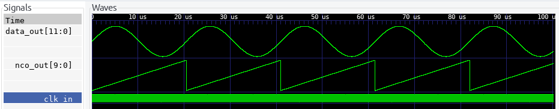
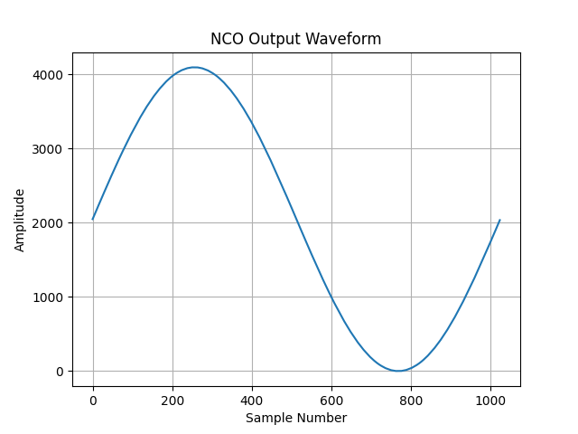
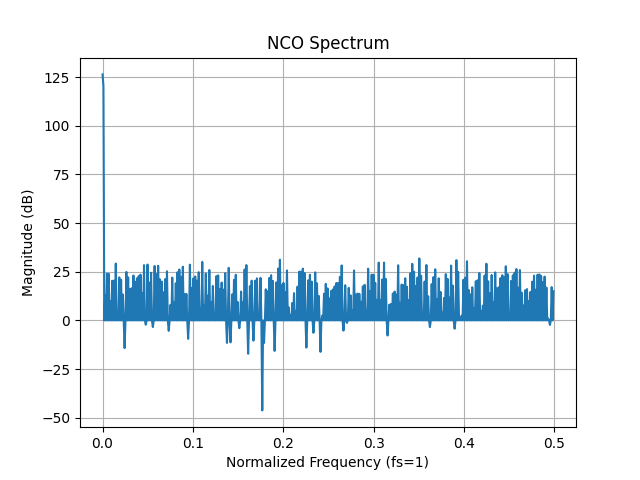

# Oscilador Controlado Numericamente (NCO)

- [NCO LUT](#nco-lut)
  - [Descripcion](#descripcion)
  - [Codigo](#codigo)
    - [Verilog](#verilog)
  - [Simulacion](#simulacion)
    - [Testbench en Python (Cocotb)](#testbench-en-python-cocotb)

## Descripcion

Ya hablando del NCO, podemos mejorarlo utilizando una tabla de consulta (LUT, Look-Up Table) para generar formas de onda más complejas, como una onda sinusoidal. En lugar de incrementar un contador linealmente, el NCO LUT utiliza el valor del contador para indexar una tabla que contiene los valores predefinidos de la forma de onda deseada.

## Codigo

### Verilog

```verilog
`include "nco.v"
`include "lut.v"


module top (
    input wire clk_in,
    input wire rst_in,
    input wire [3:0] fcw_in, // Frequency control word input
    output wire [11:0] data_out
);

    wire [9:0] nco_out;

    // Instancia del NCO
    nco #(
        .NCO_BITS(10),
        .NCO_FREQ_BITS(4)
    ) nco_inst (
        .rst_in(rst_in),
        .clk_in(clk_in),
        .fcw_in(fcw_in),
        .nco_out(nco_out)
    );

    // Instancia de la LUT
    lut #(
        .ADDR_BITS(10)
    ) lut_inst (
        .addr_in(nco_out),
        .data_out(data_out)
    );

endmodule


module lut #(
    parameter ADDR_BITS = 10
)(
    input wire [ADDR_BITS-1:0] addr_in,
    output reg [11:0] data_out
);
    reg [11:0] LUT [0:1023]; // 1024 valores de 12 bits

    initial begin
        $readmemh("sine_table.hex", LUT);
    end

    assign data_out = LUT[addr_in];

endmodule
```

## Simulacion

### Testbench en Verilog

```verilog
`include "top.v"
`timescale 1ns / 1ps


module top_tb #(
    parameter NCO_BITS = 12,
    parameter NCO_FREQ_BITS = 4 // Number of bits for frequency control word
);

    reg clk_in = 0;
    reg rst_in;
    reg [NCO_FREQ_BITS-1:0] fcw_in;
    wire [NCO_BITS-1:0] data_out;

    top dut (
        .clk_in(clk_in),
        .rst_in(rst_in),
        .fcw_in(fcw_in),
        .data_out(data_out)
    );

    initial begin
        $dumpfile("top.vcd");
        $dumpvars(0, top_tb);
    end

    always #10 clk_in = ~clk_in;
    initial begin
        // Initialize signals
        rst_in = 1;
        fcw_in = {NCO_FREQ_BITS{1'b0}};

        #20 rst_in = 0; // Release reset

        #20 fcw_in = 4'b0001; // Set frequency control word

        #100000 $finish; // End simulation
    end
endmodule
```
Obteniendo el siguiente archivo VCD:



Para visualizar la señal de salida de forma "analógica", debemos hacer click derecho en el nombre de la misma y seleccionar: Data Format -> Analog -> Step. Luego, para agrandar su tamaño, click derecho nuevamente en el nombre de la señal y seleccionar la opción Insert Analog Height Extension.

### Testbench en Python (Cocotb)

```python
import cocotb
import matplotlib.pyplot as plt
import numpy as np
from cocotb.clock import Clock
from cocotb.triggers import RisingEdge
logger = cocotb.logging.getLogger("cocotb")

NCO_BITS = 10
NCO_FREQ_BITS = 4
DATA_OUT_BITS = 12
FCW_VALUE = 1  # Valor fijo para fcw_in

@cocotb.test()
async def top_test(dut):
    # Inicializar el reloj
    cocotb.start_soon(Clock(dut.clk_in, 10, units='ns').start())
    # Resetear el DUT
    dut.rst_in.value = 1
    dut.fcw_in.value = FCW_VALUE
    await RisingEdge(dut.clk_in)
    dut.rst_in.value = 0
    await RisingEdge(dut.clk_in)
    assert dut.nco_out.value == 0, f"Expected 0, got {dut.nco_out.value}"
    assert dut.rst_in.value == 0, f"Expected 0, got {dut.rst_in.value}"

    max_count = (2**NCO_BITS)

    # max_word = (2**NCO_FREQ_BITS)
    # for value in range(1, max_word):
    # dut.fcw_in.value = value
    dut.rst_in.value = 1
    await RisingEdge(dut.clk_in)
    dut.rst_in.value = 0

    with open("sine_table.hex", "r") as f:
        lut_values = [int(line.strip(), 16) for line in f.readlines()]
    samples = []
    # Verificar el conteo de salida
    for i in range(0, max_count, FCW_VALUE):
        # final_value = (i + FCW_VALUE) % max_count
        await RisingEdge(dut.clk_in)
        assert dut.data_out.value.integer == lut_values[i], f"Expected {lut_values[i]}, got {dut.data_out.value.integer}, value={FCW_VALUE}"
        samples.append(dut.data_out.value.integer)

    samples = np.array(samples)
    spectrum = np.fft.fft(samples)
    freq = np.fft.fftfreq(len(samples))
    plt.plot(freq[:len(freq)//2], 20*np.log10(np.abs(spectrum[:len(spectrum)//2])))
    plt.title("NCO Spectrum")
    plt.xlabel("Normalized Frequency (fs=1)")
    plt.ylabel("Magnitude (dB)")
    plt.grid()
    plt.savefig("nco_output_spectrum.png")

    plt.close()

    plt.plot(samples)
    plt.title("NCO Output Waveform")
    plt.xlabel("Sample Number")
    plt.ylabel("Amplitude")
    plt.grid()
    plt.savefig("nco_output_waveform.png")
    plt.close()
```

### Resultados
Al correr la simulacion, se generan dos imagenes: `nco_output_waveform.png` y `nco_output_spectrum.png`, que muestran la forma de onda de salida del NCO y su espectro de frecuencia, respectivamente.




Como se puede observar, la forma de onda es una señal sinusoidal, y el espectro muestra un pico en la frecuencia correspondiente a la frecuencia controlada por la palabra de control de frecuencia (FCW). Esto demuestra que el NCO LUT está funcionando correctamente, generando una señal sinusoidal con la frecuencia deseada.

La frecuencia de salida del NCO se puede calcular con la siguiente formula:
```math

f_{out} = fcw.{\frac {f_{clk}} {2^{N}}}

``` 

donde:
- `f_out` es la frecuencia de salida del NCO.
- `fcw` es la palabra de control de frecuencia.
- `f_clk` es la frecuencia del reloj de entrada.
- `N` es el número de bits del acumulador del NCO.

En nuestro caso, con `fcw = 1`, `f_clk = 1` para normalizar, y `N = 10`, la frecuencia de salida es:

```math
f_{out} = 1.{\frac {1} {2^{10}}} = \frac {1} {1024} \approx 0.0009765625

```