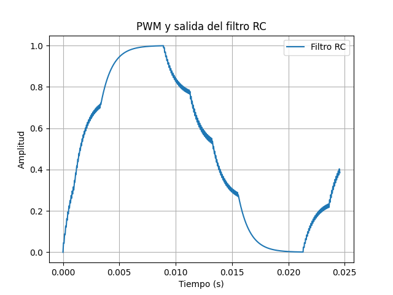

# PWM

1/10/2025

---

Con

- RC = 1000E-6
- fPWM de 12 Mhz
- fSIN = 12 Hz

Se obtiene la siguiente señal de salida del filtro RC que pareceria estar sobresampleada:

---
Cambiando la resolucion del dac de 12 a 16 bits y un RC = 2000E-6, se obtiene la siguiente señal:

---
Cambiando

- parameter NCO_FREQ_BITS = 12;
- RC = 1000E-6

Se obtiene la siguiente señal:

---
Cambiando

- parameter NCO_FREQ_BITS = 12;
- RC = 2000E-6

Se obtiene la siguiente señal:

---
Cambiando

- parameter NCO_FREQ_BITS = 13;
- RC = 1000E-6

Se obtiene la siguiente señal:

---
Cambiando

- parameter NCO_FREQ_BITS = 13;
- RC = 2000E-6

Se obtiene la siguiente señal:

---
Cambiando la resolucion del dac de 16 a 12 bits

- parameter NCO_FREQ_BITS = 8;
- RC = 2000E-6

Se obtiene la siguiente señal:

